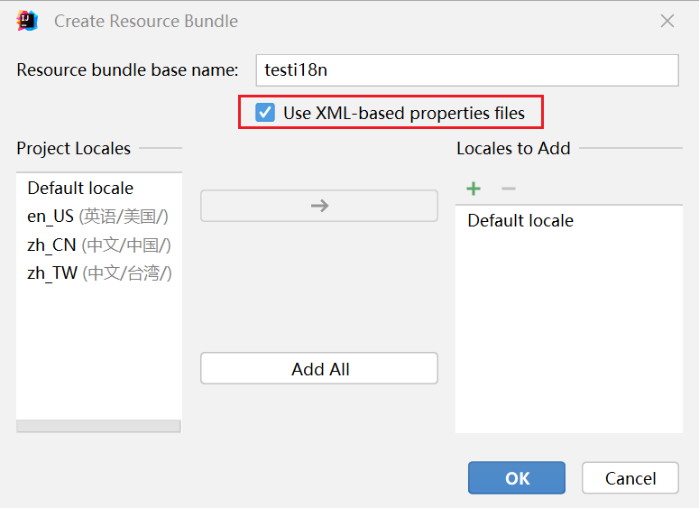

# zoic-exloc

zoic-exloc是zoic工具包下的本地化框架，使用规范化的方式引导用户进行本地化开发。

功能扩展自ResourceBundle，为其添加了XML的支持并抽象出了接口，支持Spring环境下的i18n，且支持枚举，可以更好地用于商业开发。

Java中支持i18n的类是Locale和ResourceBundle。Locale代表的地域或者国家，但是Locale同样会存储语言，可以认为是一个语言+地域的表达形式。需要注意的是，在Java、C++等语言中Locale的表达形式为“Lang_Region”，比如“zh_CN”，使用的是下划线而非一些资料提及的连字符（减号）。

#### 使用方法

1. 新建ResourceBundle，IDEA用户可以直接右键--> New --> ResourceBundle



这里需要使用XML格式。

> 为什么不推荐使用properties作为ResourceBundle？因为properties对中文的支持不友好会被转义为Unicode编码），机器可读但是人类不可读。

建立好的ResourceBundle如下：


具体有多少文件取决于你需要完成多少地区的国际化。不带语言后缀的文件作为fallback使用，当匹配不上对应的Locale时使用fallback中提供的值。

XML文件的内容如下：

```xml
<?xml version="1.0" encoding="UTF-8" standalone="no"?>
<!DOCTYPE properties SYSTEM "http://java.sun.com/dtd/properties.dtd">
<properties>
    <entry key="I0001">错误</entry>
</properties>
```

2. 开始编码

- 直接获取：

```java
String lt_zh_cn = LocalizedTag.of("i18n/testI18n", "I0001").getLocalizedString(Locale.SIMPLIFIED_CHINESE);
```

- 结构化开发（使用枚举）：

```java
enum TestI18nCodes implements LocalizedTag {

    I0001;
    
    /* 你可在这儿书写更多的ID */

    @Override
    public String tag() {
        return "i18n/testI18n" + ":" + name();
    }
}

String lt_enum_zh_cn = TestI18nCodes.I0001.getLocalizedString(Locale.SIMPLIFIED_CHINESE);
```
结构化开发所带来的好处就是代码清晰，且使用枚举可以得到IDE的提示，不容易出错。

一般来说，项目中的国际化翻译枚举和语言包应当由另一个专一的系统生成，该系统还应负责同步生成其他语言的国际化语言包（如前端需要使用的JS或者TS文件）以达到统一的标准。在通过系统下载这些语言包后再在项目中使用，此时可以得到IDE的提示支持。